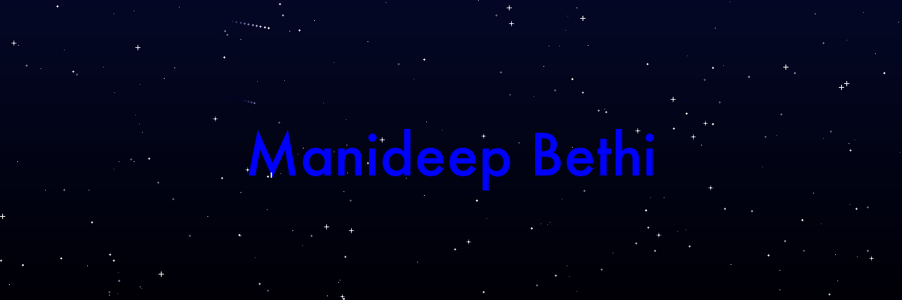

  

<h3 align="center"><b>Building Scalable AI-Powered Applications</b></h3>

<b>Full-Stack Developer</b> @ Vita Technologies | <b>Ex-Software Engineer</b> @ Reva Solutions | <b>Mentor</b> @ Topmate.io | <b>Building</b> DailySupply & DocBot | <b>Architecting</b> Agentic AI · RAG Pipelines · MCP · GenAI Systems | <b>Tech Stack:</b> React · Next.js · Node.js · TypeScript · AWS · Docker · MongoDB · PostgreSQL | <b>500+ Problems Solved</b> | <b>Open Source Contributor</b>

 
 
 
 
  
    
    

  
  &nbsp;&nbsp;&nbsp;
  

---

## 👨‍💻 About Me
- 🏗️ **Full-Stack Web Developer & AI Engineer** - Building Scalable & Optimized Web Applications
- 🚀 Architecting **Agentic AI · RAG Pipelines · MCP · Multi-Model LLM Orchestration**
- 💻 **Tech Stack Expert** - React, Node.js, Express, MongoDB, TypeScript, REST APIs
- 🧠 Passionate about **Data Structures & Algorithms** - 500+ problems solved across platforms
- 🔒 **Ethical Hacking Enthusiast** - Exploring cybersecurity and penetration testing
- 👨‍💻 **Tech Explorer** - Love to learn new technologies and explore new sets of areas
- 📚 Building **[Projects](https://github.com/bethimanideep)**
- 📫 Reach me at <a href="mailto:bethimanideep@gmail.com">bethimanideep@gmail.com</a>
- 📞 +91 8106340328

---

## 🛠️ Tech Stack & Skills 💻

<table align="center">
  <tr>
    <td align="center" width="90"> Python</td>
    <td align="center" width="90"> JavaScript</td>
    <td align="center" width="90"> TypeScript</td>
    <td align="center" width="90"> LangChain</td>
    <td align="center" width="90"> OpenAI API</td>
    <td align="center" width="90"> RAG</td>
    <td align="center" width="90"> PyTorch</td>
    <td align="center" width="90"> ChromaDB</td>
    <td align="center" width="90"> Vector DB</td>
  </tr>
  <tr>
    <td align="center" width="90"> Prompt Eng.</td>
    <td align="center" width="90"> React</td>
    <td align="center" width="90"> Next.js</td>
    <td align="center" width="90"> Node.js</td>
    <td align="center" width="90"> Express.js</td>
    <td align="center" width="90"> FastAPI</td>
    <td align="center" width="90"> Django</td>
    <td align="center" width="90"> .NET</td>
    <td align="center" width="90"> Prisma</td>
  </tr>
  <tr>
    <td align="center" width="90"> Redux</td>
    <td align="center" width="90"> React Query</td>
    <td align="center" width="90"> Tailwind CSS</td>
    <td align="center" width="90"> Bootstrap</td>
    <td align="center" width="90"> HTML</td>
    <td align="center" width="90"> CSS</td>
    <td align="center" width="90"> SSR</td>
    <td align="center" width="90"> Hybrid Rendering</td>
    <td align="center" width="90"> Linux</td>
  </tr>
  <tr>
    <td align="center" width="90"> Bash</td>
    <td align="center" width="90"> C++</td>
    <td align="center" width="90"> Java</td>
    <td align="center" width="90"> MongoDB</td>
    <td align="center" width="90"> MySQL</td>
    <td align="center" width="90"> PostgreSQL</td>
    <td align="center" width="90"> Redis</td>
    <td align="center" width="90"> Firebase</td>
    <td align="center" width="90"> ChromaDB</td>
  </tr>
  <tr>
    <td align="center" width="90"> Vector Search</td>
    <td align="center" width="90"> AIOps</td>
    <td align="center" width="90"> System Design</td>
    <td align="center" width="90"> API Optimization</td>
    <td align="center" width="90"> Docker</td>
    <td align="center" width="90"> Kubernetes</td>
    <td align="center" width="90"> AWS</td>
    <td align="center" width="90"> Azure</td>
    <td align="center" width="90"> Jenkins</td>
  </tr>
  <tr>
    <td align="center" width="90"> GitHub Actions</td>
    <td align="center" width="90"> GitLab Actions</td>
    <td align="center" width="90"> Terraform</td>
    <td align="center" width="90"> Grafana</td>
    <td align="center" width="90"> Prometheus</td>
    <td align="center" width="90"> Git</td>
    <td align="center" width="90"> GitHub</td>
    <td align="center" width="90"> GitHub Copilot</td>
    <td align="center" width="90"> VS Code</td>
  </tr>
  <tr>
    <td align="center" width="90"> PyCharm</td>
    <td align="center" width="90"> IntelliJ IDEA</td>
    <td align="center" width="90"> Figma</td>
    <td align="center" width="90"> Postman</td>
    <td align="center" width="90"> Selenium</td>
    <td align="center" width="90"> Scrapy</td>
  </tr>
</table>

---

### **⭐ Key Highlights 🎉**

<table>
  <thead>
    <tr>
      <th align="center">🎯 My Engineering Journey 🎯</th>
      <th align="center">🥇 Core Expertise & Achievements 🥇</th>
    </tr>
  </thead>
  <tbody>
    <tr>
      <td>💥 2+ Years of Professional Software Engineering Experience</td>
      <td>⭐ AI Engineer & Full-Stack Software Engineer</td>
    </tr>
    <tr>
      <td>💥 Building GenAI & LLM-powered Applications</td>
      <td>⭐ Experienced with LangGraph, LangChain, MCP, CrewAI & OpenClaw</td>
    </tr>
    <tr>
      <td>💥 Full-Stack Development with React, Next.js, Node.js & TypeScript</td>
      <td>⭐ Built Scalable Backend Architectures & Real-Time Systems</td>
    </tr>
    <tr>
      <td>💥 AWS Cloud, Docker, Kubernetes, GitHub Actions & CI/CD</td>
      <td>⭐ Enterprise Integrations with SharePoint, Box, Aconex & Microsoft Graph</td>
    </tr>
    <tr>
      <td>💥 RAG, Semantic Search & Vector Databases</td>
      <td>⭐ Amazon OpenSearch, FAISS, BM25, Pinecone & Weaviate</td>
    </tr>
    <tr>
      <td>💥 Secure Authentication & Multi-Tenant Systems</td>
      <td>⭐ JWT, OAuth2/OIDC, RBAC & Refresh Token Rotation</td>
    </tr>
    <tr>
      <td>💥 AI Document Processing & Document Chat</td>
      <td>⭐ Built DocBot using Groq, Gemini Embeddings & Pinecone</td>
    </tr>
  </tbody>
</table>

---

# 🚀 Recent Projects

## 1. DailySupply – Hyperlocal Supply Chain & E-Commerce Platform

**🔗 Live:** [dailysupply.co.in](https://dailysupply.co.in/)

- Architected and engineered an end-to-end **hyperlocal supply chain and e-commerce platform** connecting local vendors with residents in high-rise gated communities utilizing a robust **multi-tenant architecture**.
- Built scalable backend microservices for **product catalog management, vendor-specific dynamic pricing, real-time inventory management, order processing pipelines**, and **society-based vendor mapping** using **Node.js, TypeScript, Prisma ORM, and MariaDB**.
- Enforced enterprise-grade security including **Role-Based Access Control (RBAC)** and **JWT authentication with secure refresh token rotation**, ensuring strict tenant isolation and multi-tenant data protection.
- Designed **Prisma transactions** for atomic order checkouts, implemented **centralized error logging middleware** to capture stack traces and request metadata for proactive debugging, and automated comprehensive API documentation with **OpenAPI (Swagger)**.
- Engineered vendor analytics dashboards for **settlement summaries, revenue tracking, and order performance reporting**, while automating deployment workflows with **GitHub Actions CI/CD pipelines**.

---

## 2. SharePoint Online – Oracle Aconex Enterprise Connector

**🔗 Live:** [marketplace.oracle.com/sharepoint-connector-for-aconex](https://marketplace.oracle.com/listings/sharepoint-connector-for-aconex/ocid1.mktpublisting.oc1.iad.amaaaaaaiue7m7qarvlr6cj4t5dbse6t7xkhroejlgpreqnczzjvaest7t6a)

- Built a high-performance, enterprise-grade **file transfer and synchronization solution** capable of managing massive file uploads **up to 250 GB** using the **Microsoft Graph SDK** and **SharePoint REST APIs**.
- Optimized memory consumption and system throughput by migrating from traditional buffer-based transfers to **high-efficiency streaming-based chunked file transfers**.
- Engineered an asynchronous processing pipeline utilizing **queue processing, chunked uploads, worker threads, and parallel execution** to maximize network throughput while preventing memory exhaustion and system crashes.
- Enhanced long-term maintainability and enterprise compatibility by refactoring legacy PnP connectors to modern **SharePoint Online REST APIs and Microsoft Graph**.
- Integrated **real-time bi-directional transfer progress tracking using WebSockets**, delivering live upload/download percentage, throughput metrics, and active file state updates to the UI.

---

## 3. DocBot – AI-Powered Conversational Document Intelligence

**🔗 Live:** [github.com/bethimanideep](https://github.com/bethimanideep)

- Architected and built an end-to-end **AI document processing and conversational RAG platform** enabling users to upload files and interact with complex multi-format documents via natural language queries.
- Integrated seamless **Google Drive connectivity via Passport.js OAuth2**, allowing direct document ingestion, text extraction, and automated preprocessing from cloud storage.
- Implemented a vector search pipeline using **Google Gemini Embedding Model** and **Pinecone Cloud Vector Database** for high-dimensional semantic search and hybrid context retrieval.
- Leveraged ultra-low-latency **Groq LLM inference** with optimized prompt templates to deliver fast, context-grounded, and hallucination-resistant answers in real-time.
- Developed a comprehensive security layer featuring **OTP-based user authentication, Passport.js Google OAuth, and JWT session token management** for secure multi-user document isolation.

---

## 4. ArcGIS Survey123 – Box Cloud Spatial Data Integration

**🔗 Live:** [esri.com/arcgis-survey123](https://www.esri.com/en-us/arcgis/products/arcgis-survey123/overview)

- Engineered an automated serverless GIS document generation engine that extracts spatial survey data from **ArcGIS Survey123** and compiles dynamic spatial reports in **PDF and DOCX formats**.
- Built an event-driven processing pipeline powered by **AWS Lambda and webhook triggers**, achieving near real-time document compilation and transformation in **under 2 seconds**.
- Integrated **Box Cloud API** for secure, automated file uploads, dynamic directory structuring, and instant stakeholder access management.
- Implemented automated error handling, retries, and telemetry to ensure high pipeline reliability and seamless enterprise survey data processing.

---

    

## 📧 Connect with me:

  &nbsp;&nbsp;
  &nbsp;&nbsp;
  &nbsp;&nbsp;
  &nbsp;&nbsp;
  &nbsp;&nbsp;
  

